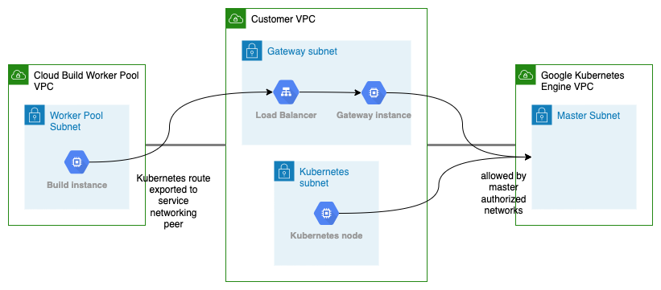

# Transitive GKE peering using Load balanced gateway instance

This Terraform configuration deploys a gateway instance as a next-hop to allow all Google peerings to reach the GKE master instances.



## Tricky bits

The Cloud Build Worker Pool peering is created through the Service Networking peering. As a result, all Service Networking peerings are able to access the GKE master through the gateway instance. If you only want to allow the Cloud Build Worker Pool peering, you have to configure the gateway instance firewall such that it denies traffic from other peers.


## Deploy & Test

Specify your project id in the variables.tf file and deploy using Terraform.

```
terraform init
terraform apply
```

Next initialize the source repository and push a change to trigger a build.

```
cd demo

./repo_init.sh
./repo_trigger.sh
```

Finally notice that the cloud build job accesses the Kubernetes master, without any magic - as shown in the `demo/cloudbuild.yaml`-file.
