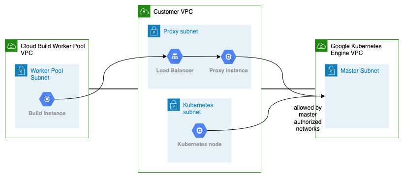

# Transitive GKE peering using Load balanced proxy instance

This Terraform configuration deploys a proxy to reach the GKE master instances.



## Tricky bits

The clients must configure the proxy to access the GKE master instances. This can be a pain, because not all tools respect the ALL_PROXY/HTTPS_PROXY variables.


## Deploy & Test

Specify your project id in the variables.tf file and deploy using Terraform.

```
terraform init
terraform apply
```

Next initialize the source repository and push a change to trigger a build.

```
cd demo

./repo_init.sh
./repo_trigger.sh
```

Finally notice that the cloud build job accesses the Kubernetes master using the proxy - as shown in the `demo/cloudbuild.yaml`-file.
